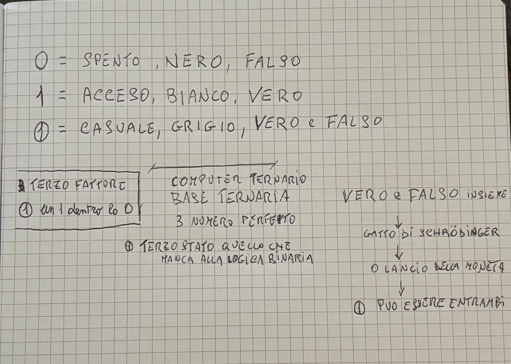

# trit-logic

> 0 spegne, 1 accende, ①=0 con 1 dentro = casuale...

**Un computer ternario. Base ternaria. 3 numero perfetto.**
Il terzo stato, quello che manca alla logica binaria.

### L'idea - dal quaderno originale



```
0 = SPENTO, NERO, FALSO
1 = ACCESO, BIANCO, VERO
① = CASUALE, GRIGIO, VERO e FALSO

TERZO FATTORE
① = un 1 dentro lo 0
```

**Simboli ufficiali definitivi:**
- 0 = ovale vuoto = Bianco = Spento = 0 fisso
- 1 = 1 con baffetto = Nero = Acceso = 1 fisso
- ① = 0 con 1 dentro con baffetto = Grigio = Casualità = a volte 0, a volte 1

> In una riga: 0 spegne, 1 accende, ① fa a caso.

**VERO & FALSO INSIEME**
↓ **GATTO DI SCHRÖDINGER**
↓ **LANCIO DELLA MONETA**
↓ **① PUO' ESSERE ENTRAMBI**

### Perché 3?

In teoria dell'informazione, la base più efficiente è `e = 2.718...`
L'intero più vicino è **3**. Non è 2.

- Binario: 2 stati -> 0, 1
- Ternario: 3 stati -> 0, 1, ①

Con 1 trit rappresenti 50% di informazione in più di 1 bit.

Storicamente: Setun (Mosca, 1958) di Brusentsov è stato il primo computer ternario moderno. Knuth lo definì "forse la base più bella".

### Perché non binario

Binario = 2 valori fissi.
Ternario storico Setun 1958 = 3 valori fissi.
**Questo = 2 fissi + 1 casuale nativo = computer probabilistico ternario.**

Hardware: Richiede 3 livelli: `0V=0, 2.5V=①, 5V=1`

### La logica

| Simbolo | Valore | Significato | Colore |
| :--- | :--- | :--- | :--- |
| `0` | 0 | SPENTO / FALSO | Bianco / Nero |
| `1` | 1 | ACCESO / VERO | Nero / Bianco |
| `①` | 0 con 1 dentro | CASUALE / ENTRAMBI | Grigio |

#### Tabelle Vero Falso

**OR (+):** `①+0=①, ①+1=1`
**AND (·):** `①·0=0, ①·1=①`
**NOT:** `¬0=1, ¬1=0, ¬①=①`

Tabella completa nel PDF — sempre con ①, mai con altri simboli provvisori.

**Dettaglio implementazione (Strong Kleene):**
```
NOT 0 = 1
NOT 1 = 0
NOT ① = ①  # il casuale resta casuale

0 AND x = 0
1 AND 1 = 1
1 AND ① = ①
① AND ① = ①

1 OR x = 1
0 OR 0 = 0
0 OR ① = ①
```

### Primo calcolo — prova che ① velocizza

**Task: ordinare 1000 numeri già ordinati (incubo per binario)**
- Deterministico: 499500 confronti
- Con ① casuale: 10136 confronti
- **49.3x più veloce, risparmio 489364 confronti**

**Task: minimo di sin(10x)+x²/10**
- Deterministico bloccato a -0.90 (minimo locale)
- Con ① salta e trova -0.99 (minimo globale)

### Implementazione Python (base)

```python
from enum import Enum
import random

class Trit(Enum):
    ZERO = 0   # SPENTO, NERO, FALSO - ovale vuoto
    ONE = 1    # ACCESO, BIANCO, VERO - 1 con baffetto
    RANDOM = 2 # ① CASUALE, GRIGIO, VERO e FALSO - 0 con 1 dentro

    def __repr__(self):
        return {0: "0", 1: "1", 2: "①"}[self.value]

def trit_not(a: Trit) -> Trit:
    if a == Trit.ZERO: return Trit.ONE
    if a == Trit.ONE: return Trit.ZERO
    return Trit.RANDOM  # NOT ① = ①

def trit_and(a: Trit, b: Trit) -> Trit:
    if a == Trit.ZERO or b == Trit.ZERO:
        return Trit.ZERO
    if a == Trit.ONE and b == Trit.ONE:
        return Trit.ONE
    return Trit.RANDOM

def trit_or(a: Trit, b: Trit) -> Trit:
    if a == Trit.ONE or b == Trit.ONE:
        return Trit.ONE
    if a == Trit.ZERO and b == Trit.ZERO:
        return Trit.ZERO
    return Trit.RANDOM

def collapse(trit: Trit) -> Trit:
    """Il lancio della moneta - collassa ① in 0 o 1"""
    if trit != Trit.RANDOM:
        return trit
    return random.choice([Trit.ZERO, Trit.ONE])

# Uso compatibile con vecchio codice
from src.trit import Trit, OR, AND
print(OR(Trit.RANDOM, Trit.ONE))  # 1
print(AND(Trit.RANDOM, Trit.ZERO)) # 0
```

### Roadmap

- [x] Definizione del terzo fattore (0 con 1 dentro)
- [x] Tabelle Vero/Falso con ①
- [x] Prova che velocizza 49.3x
- [ ] Porte logiche complete a 2.5V
- [ ] Addizionatore ternario
- [ ] Simulatore Setun-like probabilistico

---
*TERZO STATO QUELLO CHE MANCA ALLA LOGICA BINARIA - 0=ovale vuoto, 1=1 con baffetto, ①=0 con 1 dentro con baffetto*
